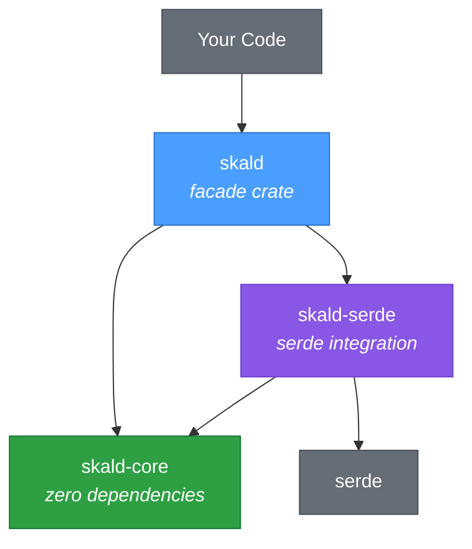
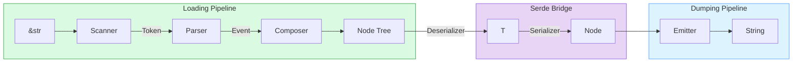
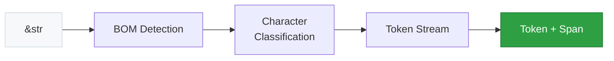
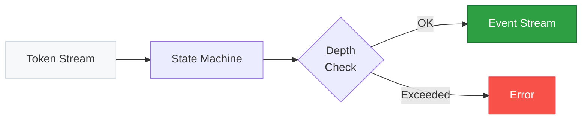
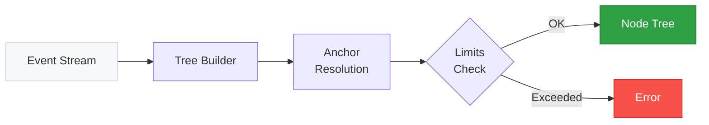
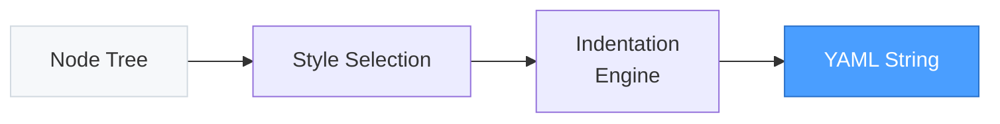

# Skald

**Safe YAML for Rust** — zero `unsafe` by default, full YAML 1.2.2 spec compliance, high performance.

[](LICENSE-MIT)
[](https://www.rust-lang.org)
[](https://codecov.io/gh/elioetibr/skald)
[](https://securityscorecards.dev/viewer/?uri=github.com/elioetibr/skald)
[](https://slsa.dev)

Skald is a from-scratch YAML 1.2.2 library built for safety, correctness, and speed. It passes **100% of the official YAML test suite** (735/735 tests) and provides both a serde integration and a low-level node API.

## Quick Start

Add to your `Cargo.toml`:

```toml
[dependencies]
skald = "0.1"
serde = { version = "1", features = ["derive"] }
```

### Deserialize with Serde

```rust
use serde::Deserialize;

#[derive(Deserialize)]
struct Config {
    name: String,
    debug: bool,
    port: u16,
}

let config: Config = skald::from_str("
name: my-app
debug: true
port: 8080
").unwrap();

assert_eq!(config.name, "my-app");
assert_eq!(config.port, 8080);
```

### Serialize with Serde

```rust
use serde::Serialize;

#[derive(Serialize)]
struct Point { x: i32, y: i32 }

let yaml = skald::to_string(&Point { x: 1, y: 2 }).unwrap();
// x: 1
// y: 2
```

### Round-Trip

```rust
use serde::{Deserialize, Serialize};

#[derive(Serialize, Deserialize, PartialEq, Debug)]
struct Server {
    host: String,
    port: u16,
}

let original = Server { host: "localhost".into(), port: 443 };
let yaml = skald::to_string(&original).unwrap();
let restored: Server = skald::from_str(&yaml).unwrap();
assert_eq!(original, restored);
```

### Node API (No Serde)

For dynamic YAML processing without predefined types:

```rust
// Parse
let node = skald::from_str_node("hello: world").unwrap();
let entries = node.as_mapping().unwrap();
assert_eq!(entries[0].0.as_str(), Some("hello"));
assert_eq!(entries[0].1.as_str(), Some("world"));

// Emit
let yaml = skald::to_string_node(&node);
assert_eq!(yaml, "hello: world\n");
```

### Multi-Document

```rust
let docs = skald::from_str_multi("---\nfirst\n---\nsecond\n").unwrap();
assert_eq!(docs.len(), 2);
assert_eq!(docs[0].as_str(), Some("first"));
```

### Read from Files

```rust
use serde::Deserialize;

#[derive(Deserialize)]
struct Config { name: String }

let file = std::fs::File::open("config.yaml").unwrap();
let config: Config = skald::from_reader(file).unwrap();
```

## Why Skald?

### Safety First

- **`#![forbid(unsafe_code)]`** on the core crate — no exceptions
- **Built-in resource limits** protect against adversarial inputs out of the box:

| Protection                        | Default Limit |
| --------------------------------- | ------------- |
| Nesting depth (stack overflow)    | 128 levels    |
| Alias expansions (billion laughs) | 1,024         |
| Document size (memory exhaustion) | 256 MiB       |
| Key length                        | 1,024 bytes   |
| Node count (CPU exhaustion)       | 1,000,000     |

- **Strict mode by default** — duplicate keys are errors, not silent overwrites

### Spec Complete

- **735/735** [Official YAML Test Suite](https://github.com/yaml/yaml-test-suite) cases pass (v2022-01-17)
- Full YAML 1.2.2 support: anchors, aliases, tags, block scalars, flow collections, multi-document streams
- Correct handling of edge cases that trip up other parsers

### Fast

Benchmarked against [yaml-rust2](https://github.com/Ethiraric/yaml-rust2) (the most used Rust YAML parser) on real-world documents (K8s Pod, Helm values, 800-entry config):

| Operation | Small (~210B) | Medium (~3KB) | Large (~119KB) | vs yaml-rust2          |
| --------- | ------------- | ------------- | -------------- | ---------------------- |
| **Parse** | 68 us         | 663 us        | 34.2 ms        | **1.3x – 2.0x faster** |
| **Load**  | 99 us         | 1.2 ms        | 46.3 ms        | **up to 2.2x faster**  |
| **Emit**  | 10.7 us       | 49 us         | 2.5 ms         | **1.8x – 5.4x faster** |

Skald reads YAML about **twice as fast** and writes it up to **5x faster**. The emitter processes data at **45–63 MB/s** compared to yaml-rust2's **9–13 MB/s**, making Skald particularly well-suited for tools that generate a lot of YAML output.

### Zero-Copy Design

Scalar values use `Cow<'a, str>` — when no transformation is needed (plain scalars), Skald borrows directly from the input buffer with zero allocation.

## Crate Architecture

Skald is organized as a workspace of focused crates:



### Processing Pipeline



Each stage is independently usable. You can scan tokens, consume parser events, or work with the composed node tree — whatever level of control you need.

### Scanner

Reads raw `&str` input byte-by-byte and produces a stream of typed tokens. Handles BOM detection, character classification via `[u8; 256]` lookup tables, and tracks source positions for span reporting.



### Parser

Consumes tokens from the scanner and produces a stream of semantic events. Uses an iterative state machine (no recursion) with depth checking against `ResourceLimits::max_depth`.



### Composer

Transforms the event stream into a `Node` tree. Resolves anchors/aliases, enforces duplicate key detection, and checks node count, key length, and alias expansion limits.



### Emitter

Walks a `Node` tree and writes YAML text. Supports configurable indentation, key sorting, explicit document markers, and all scalar styles (plain, single-quoted, double-quoted, literal block, folded block).



## Advanced Usage

### Custom Emitter Configuration

```rust
use serde::Serialize;
use skald::emitter::EmitterConfig;

#[derive(Serialize)]
struct Data { key: String }

let config = EmitterConfig {
    indent: 4,                  // 4 spaces (default: 2)
    sort_keys: true,            // alphabetical keys
    explicit_document: true,    // emit --- markers
    ..EmitterConfig::default()
};

let yaml = skald::to_string_with(&Data { key: "val".into() }, &config).unwrap();
assert!(yaml.starts_with("---"));
```

### Working with `Value` (Dynamic Typed)

```rust
// Parse YAML into a dynamic Value, then serialize back
let value: skald::Value = skald::from_str("
name: skald
tags:
  - yaml
  - rust
").unwrap();

assert!(value.is_mapping());
let yaml = skald::to_string(&value).unwrap();
```

### Low-Level Pipeline Access

```rust
use skald::scanner::Scanner;
use skald::parser::Parser;
use skald::composer;

// Scan tokens
let scanner = Scanner::new("key: value");
for token in scanner {
    println!("{:?}", token.unwrap());
}

// Parse events
let parser = Parser::new("key: value");
for event in parser {
    println!("{:?}", event.unwrap());
}

// Compose nodes
let nodes = composer::compose_all("key: value").unwrap();
```

## Real-World Examples

Skald handles the YAML formats you actually work with:

```rust
use serde::Deserialize;

// Kubernetes manifests
#[derive(Deserialize)]
struct K8sPod {
    #[serde(rename = "apiVersion")]
    api_version: String,
    kind: String,
    metadata: Metadata,
}

#[derive(Deserialize)]
struct Metadata {
    name: String,
    #[serde(default)]
    labels: std::collections::BTreeMap<String, String>,
}

let pod: K8sPod = skald::from_str("
apiVersion: v1
kind: Pod
metadata:
  name: nginx
  labels:
    app: web
").unwrap();

assert_eq!(pod.kind, "Pod");
assert_eq!(pod.metadata.labels["app"], "web");
```

## Minimum Supported Rust Version

Rust **1.88** or later (edition 2024).

## License

Licensed under either of

- [Apache License, Version 2.0](LICENSE-APACHE-2.0)
- [MIT License](LICENSE-MIT)
