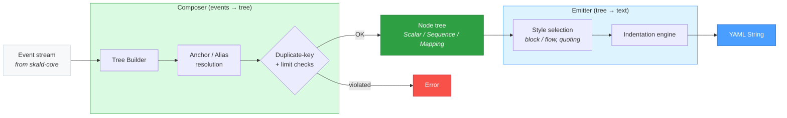

# skald-ast

Skald YAML AST: the `Node` representation tree, composer, and emitter.

`skald-ast` is the representation-tree layer of the [Skald](../README.md) YAML
1.2.2 toolkit. It sits directly above `skald-core`: the core front-end turns
text into a stream of parser **events**, and `skald-ast` turns those events into
an in-memory `Node` tree (the **composer**) and turns a `Node` tree back into
YAML text (the **emitter**).

This crate is the foundation that higher layers build on — `skald-serde` and the
tooling crates consume the `Node` tree rather than raw events. Its only
dependency is `skald-core`; it pulls in no `serde` and no third-party code, and
carries `#![forbid(unsafe_code)]`.

## Package Structure

```text
src/
├── lib.rs            # Crate root: re-exports Node/Scalar/Sequence/Mapping,
│                     #   Composer/compose_all, EmitterConfig/emit/emit_to_string
├── node.rs           # The representation graph: Node enum + Scalar/Sequence/
│                     #   Mapping structs, span()/tag()/as_* accessors, into_owned()
├── composer/
│   └── mod.rs        # Composer: Event stream → Node tree. Anchor/alias
│                     #   resolution, duplicate-key detection, merge keys, limits
└── emitter/
    └── mod.rs        # Emitter: Node tree → YAML text. Style selection,
                      #   indentation, scalar quoting/escaping, key sorting
```

## Architecture

The composer and emitter are mirror images across the `Node` tree: the composer
folds an event stream down into a tree (resolving anchors and rejecting
duplicate keys along the way), and the emitter walks the tree back out to text
(choosing styles and indentation).



## The Node Tree

The representation graph is a single recursive enum, `Node<'a>`, with one
variant per YAML node kind:

```rust
pub enum Node<'a> {
    Scalar(Scalar<'a>),     // leaf value
    Sequence(Sequence<'a>), // ordered list
    Mapping(Mapping<'a>),   // ordered key/value pairs
}
```

Each variant wraps a struct that carries the data plus presentation metadata:

| Type           | Fields                                                                          |
| -------------- | ------------------------------------------------------------------------------- |
| `Scalar<'a>`   | `value: Cow<'a, str>`, `tag: Option<Tag<'a>>`, `style: ScalarStyle`, `span: Span`     |
| `Sequence<'a>` | `items: Vec<Node<'a>>`, `tag: Option<Tag<'a>>`, `style: CollectionStyle`, `span: Span` |
| `Mapping<'a>`  | `entries: Vec<(Node<'a>, Node<'a>)>`, `tag`, `style: CollectionStyle`, `span: Span`     |

Design notes, verified against `node.rs`:

- **Zero-copy scalars.** `Scalar::value` is a `Cow<'a, str>` whose lifetime
  ties back to the input buffer. Plain scalars that need no transformation are
  `Cow::Borrowed` — no allocation. `Node::into_owned()` (and the per-struct
  `into_owned()` helpers) promote a borrowed tree to `Node<'static>` when you
  need to outlive the source.
- **Span on every node.** Every node carries a `Span`, retrieved uniformly via
  `Node::span()`. This is what lets downstream tooling produce
  source-located diagnostics.
- **Ordered mappings.** `Mapping` uses `Vec<(Node, Node)>`, not a hash map —
  insertion order is preserved (required by the YAML spec) and non-scalar keys
  are supported. Duplicate-key detection is handled in the composer, not by the
  container.
- **Style preserved.** `ScalarStyle` (plain, single/double-quoted, literal,
  folded) and `CollectionStyle` (block / flow) are recorded so a parsed tree can
  be re-emitted in the same shape.

Convenience accessors keep traversal terse: `is_scalar()` / `is_sequence()` /
`is_mapping()`, `as_str()`, `as_sequence()`, `as_mapping()`, and `tag()`.

## Usage

### Compose YAML into a `Node` tree

```rust
use skald_ast::compose_all;

let docs = compose_all("name: skald\nport: 8080\n").unwrap();
assert_eq!(docs.len(), 1);

let entries = docs[0].as_mapping().unwrap();
assert_eq!(entries[0].0.as_str(), Some("name"));
assert_eq!(entries[0].1.as_str(), Some("skald"));
```

`compose_all` returns one `Node` per document. For streaming control (per-document
limits, custom `ParserConfig`), use the `Composer` iterator directly:

```rust
use skald_ast::Composer;

let mut composer = Composer::new("---\nfirst\n---\nsecond\n");
let first = composer.next().unwrap().unwrap();
assert_eq!(first.as_str(), Some("first"));
```

### Emit a `Node` tree back to YAML

```rust
use skald_ast::{compose_all, emit_to_string, EmitterConfig};

let node = compose_all("b: 2\na: 1\n").unwrap().remove(0);

let config = EmitterConfig {
    indent: 4,                // spaces per level (default: 2)
    sort_keys: true,          // alphabetize mapping keys (default: false)
    explicit_document: true,  // wrap output in `---` / `...` (default: false)
    ..EmitterConfig::default()
};

let yaml = emit_to_string(&node, &config);
assert!(yaml.starts_with("---"));
assert!(yaml.contains("a: 1")); // sorted before `b`
```

`EmitterConfig` also exposes `line_width` (soft flow-style target, default 80)
and `prefer_block` (default true). To stream into an existing buffer instead of
allocating a `String`, use `emit(node, &config, &mut writer)` with any
`fmt::Write` destination.

## Composer & Emitter

### Composer

The `Composer` drives `skald-core`'s parser and folds its event stream into a
`Node` tree, one document per `Iterator::next` call. Beyond plain tree-building
it is responsible for the semantic checks that events alone cannot express:

- **Anchors and aliases.** `&name` registers a node in a per-document anchor
  table; `*name` clones the anchored node into the tree. The table is cleared at
  each document boundary so anchors never leak between documents.
- **Duplicate keys.** In `Strictness::Strict` mode (the default), duplicate
  scalar keys within a mapping are an error. Detection is O(1) per key via a
  `HashSet<Cow>` side structure; the error reports the span of the first
  occurrence. Lenient mode keeps both entries.
- **Merge keys.** When enabled in `ParserConfig`, `<<` keys fold a mapping (or a
  sequence of mappings) in as defaults, with explicit keys and earlier sources
  winning.
- **Resource limits.** Node count, scalar/key length, and alias-expansion limits
  from `skald-core`'s `ResourceLimits` are enforced as the tree is built,
  guarding against billion-laughs and memory-exhaustion inputs.

### Emitter

The emitter walks a `Node` tree and writes YAML text to any `fmt::Write` sink.
Its responsibilities are presentation, not semantics:

- **Style selection.** Each node's recorded `CollectionStyle` chooses block vs.
  flow output; each scalar's `ScalarStyle` chooses plain, single-quoted,
  double-quoted, or literal/folded block form. The emitter trusts the caller's
  style choice — quoting decisions for ambiguous values are made upstream by the
  serializer, not re-litigated here.
- **Escaping.** Single-quoted output doubles embedded apostrophes;
  double-quoted output emits named escapes (`\n`, `\t`, …) and `\xXX` for other
  control characters.
- **Indentation.** Nesting level times `EmitterConfig::indent` produces the
  leading whitespace; nested block collections inline their first item after the
  parent's `-` or `key:`.
- **Optional transforms.** `sort_keys` reorders mapping entries alphabetically
  (stable for non-scalar keys); `explicit_document` brackets output with `---`
  and `...`.
