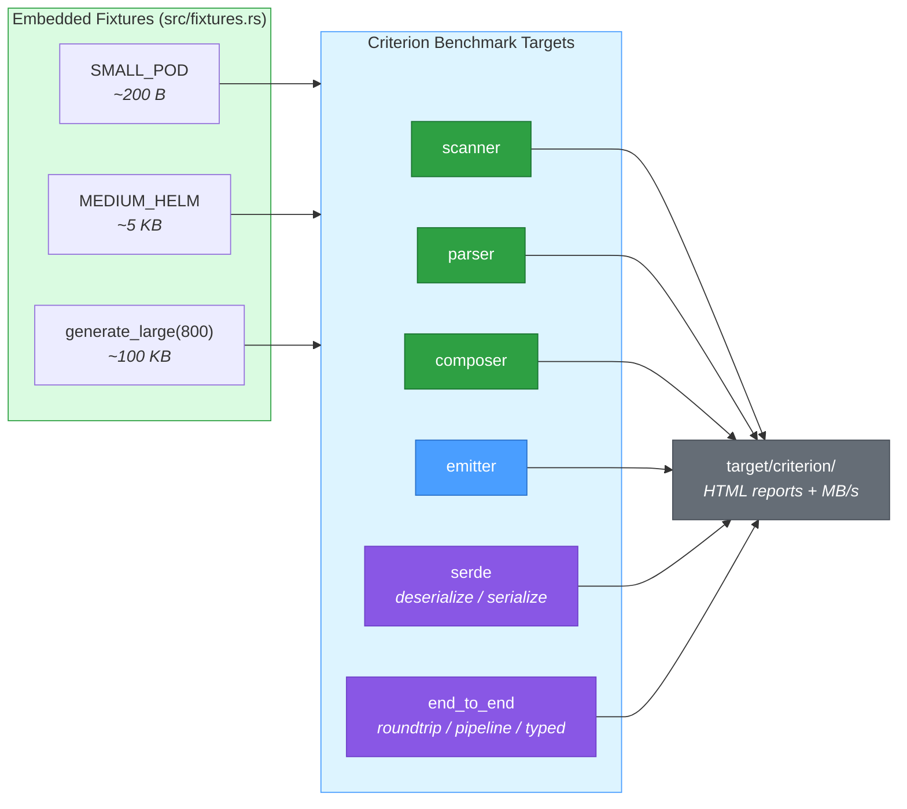

# skald-bench

Criterion benchmark suite for the Skald YAML pipeline.

> **Dev-only crate.** `publish = false` — not released to crates.io. It exists purely to measure Skald and is never part of the shipped dependency graph.

Skald is a safety-first YAML 1.2.2 library for Rust (edition 2024). This crate holds the Criterion micro- and end-to-end benchmarks that cover **every pipeline stage** (scanner, parser, composer, emitter) plus head-to-head serde comparisons against the wider YAML/serde ecosystem. Fixtures are embedded constants — there is no file I/O in the hot path.

## Running

Run the whole suite:

```sh
cargo bench -p skald-bench
```

Run a single benchmark target (`--bench <name>`):

```sh
cargo bench -p skald-bench --bench scanner
cargo bench -p skald-bench --bench parser
cargo bench -p skald-bench --bench composer
cargo bench -p skald-bench --bench emitter
cargo bench -p skald-bench --bench serde
cargo bench -p skald-bench --bench end_to_end
```

Criterion writes HTML reports (the `html_reports` feature is enabled) to `target/criterion/`.

## Benchmark Suites

Each `[[bench]]` target sets `harness = false` and drives Criterion directly. Several targets register more than one Criterion group.

| `--bench` target | Criterion group(s)                                                                | What it measures                                                                                  |
| ---------------- | --------------------------------------------------------------------------------- | ------------------------------------------------------------------------------------------------- |
| `scanner`        | `scanner`                                                                         | Tokenizing `&str` → `Token` (`Scanner::next_token` loop). Skald only — no competitor token API.   |
| `parser`         | `parser`                                                                          | Tokens → `Event` (`Parser::next_event` loop) vs `yaml-rust2`'s event stream.                       |
| `composer`       | `composer`                                                                        | Events → `Node` tree (`compose_all`) vs `yaml-rust2` and `rust-yaml` tree loads.                   |
| `emitter`        | `emitter`                                                                         | `Node` tree → YAML text, emitting from each library's own pre-parsed tree (measures emission only).|
| `serde`          | `serde_deserialize`, `serde_serialize`                                            | Typed/`Value` deserialize and serialize vs `serde_json`, `noyalib`, `serde_yaml_ng`, `serde-saphyr`.|
| `end_to_end`     | `roundtrip_node`, `roundtrip_compare`, `full_pipeline_node`, `typed_struct`, `typed_large` | Parse→emit→parse roundtrips, cross-library load→emit, facade vs raw `compose_all` overhead, and typed-struct deserialize (incl. the integer-heavy large fixture for the SWAR decimal path). |

All groups use `Throughput::Bytes` so results report MB/s, and parameterize over the three fixture sizes (`small`, `medium`, `large`) unless noted.

## Fixtures

Embedded in `src/fixtures.rs`. Each has a matching JSON equivalent (`*_JSON` / `generate_large_json`) so serde benches can compare against a `serde_json` speed-of-light baseline.

| Fixture               | Size    | Shape                                                                                                            |
| --------------------- | ------- | -------------------------------------------------------------------------------------------------------------- |
| `SMALL_POD`           | ~200 B  | Minimal Kubernetes Pod spec — plain scalars, nested mappings, sequences.                                        |
| `MEDIUM_HELM`         | ~5 KB   | Realistic Helm `values.yaml` — nested maps, flow sequences, literal block scalars, quoted strings, comments, an anchor/alias (`&default_resources` / `*default_resources`). |
| `generate_large(800)` | ~100 KB | 800 generated entries (~125 B each); every entry mixes string, `u64`, `f64`, bool, a string sequence, and a nested mapping. Drives integer/float parse hot paths. |

## Competitors

Benched against the YAML/serde ecosystem. All are **dev-dependencies of `skald-bench` only**, and each carries a `deny.toml` `skip-tree` exemption so its transitive tree does not trip the multiple-versions gate — the shipped `skald-*` graph stays competitor-free.

| Crate            | Version  | Role in the benchmarks                                                                 |
| ---------------- | -------- | -------------------------------------------------------------------------------------- |
| `noyalib`        | 0.0.7    | **Deserialize target-to-beat** (Phase 4b). Compared in serde deserialize/serialize.    |
| `serde_yaml_ng`  | 0.10     | Active `serde_yaml` fork. Compared in serde deserialize/serialize.                      |
| `serde-saphyr`   | 0.0.27   | Saphyr-based serde adapter; no native `Value`, so it (de)serializes `serde_json::Value`.|
| `yaml-rust2`     | 0.11     | Pipeline-stage (parser/composer/emitter) and tree-level roundtrip comparisons.         |
| `rust-yaml`      | 1        | Tree-level load/dump and roundtrip (no streaming token/event API to compare).          |
| `serde_json`     | 1        | Speed-of-light JSON baseline for the serde benches (parses the JSON-equivalent fixtures).|

> `serde_yml` is intentionally **EXCLUDED**: RUSTSEC-2025-0068 (unsound segfault in its serializer) plus archived upstream. The `deny.toml` zero-advisory-tolerance policy forbids depending on it.

## Architecture



## Methodology

- **Embedded constant fixtures, zero hot-path I/O.** All inputs are compile-time `&str` constants (or generated once outside the measured loop), so benchmarks measure the pipeline rather than the filesystem.
- **Inputs are pre-parsed outside the hot loop where appropriate.** The emitter and serialize benches build each library's native tree/value up front so the timed region measures only emission/serialization, not cross-library conversion.
- **`black_box` on inputs and outputs** to defeat the optimizer eliding work.
- **Criterion measurement time ≥ 15s** per group (the project minimum that avoids Criterion's "unable to complete 100 samples" warning). Roundtrip-heavy groups run longer: `roundtrip_node` 25s, `composer`/`emitter` 30s, `roundtrip_compare` 40s.
- **Throughput in `Throughput::Bytes`** keyed on the YAML byte length, so results are reported as MB/s and stay comparable across fixture sizes (serde benches normalize on YAML length even when feeding JSON to the baseline).

For the published "fast" story (Parse / Load / Emit vs `yaml-rust2` across the small/medium/large fixtures), see the benchmark results table in the [root README](../README.md#fast).
