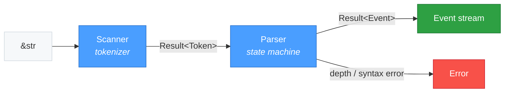
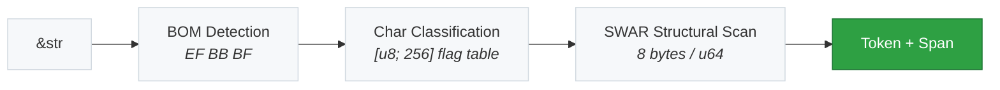

# skald-core

**Core YAML 1.2.2 scanner, parser, and composer — safe, fast, spec-complete.**

`skald-core` is the zero-dependency front-end of the [Skald](../README.md) YAML
workspace. It provides the two foundational pipeline stages — the **Scanner**
(`&str` → `Token`) and the **Parser** (`Token` → `Event`) — together with the
shared types, error model, and resource limits that every other crate builds on.

It has **no dependencies** (not even `serde`), carries no `Node` tree (that
lives in `skald-ast`), and is compiled with `#![forbid(unsafe_code)]`. Everything
downstream — `skald-ast`, `skald-serde`, and the `skald` facade — consumes the
token and event streams emitted here.

## Package Structure

```text
src/
├── lib.rs              # Crate root; re-exports error, limits, parser, scanner, types
├── types.rs            # Position, Span, Tag, ScalarStyle, CollectionStyle
├── error.rs            # Error, ErrorKind, Strictness, SchemaKind, ParserConfig, ParserPolicies
├── limits.rs           # ResourceLimits and safe defaults
├── parser/
│   ├── mod.rs          # Parser: iterative state machine (Token → Event), depth-checked
│   └── event.rs        # Event, EventKind (SAX-style document stream)
└── scanner/
    ├── mod.rs          # Scanner: tokenizer (&str → Token), BOM + indentation tracking
    ├── token.rs        # Token, TokenKind
    ├── chars.rs        # [u8; 256] character-classification lookup tables (FLAG_* bits)
    └── swar.rs         # SWAR (SIMD-Within-A-Register) structural-byte scan — 100% safe
```

## Architecture

The crate is a streaming front-end: bytes flow through the Scanner into a token
stream, which the Parser folds into a stream of semantic events. Both stages are
iterators (`Iterator<Item = Result<Token>>` and `Iterator<Item = Result<Event>>`),
so consumers pull lazily without materializing the whole document.



### Scanner Internals

The Scanner reads the input byte-by-byte. It first strips an optional UTF-8 BOM
(`EF BB BF`), classifies each byte through a compile-time `[u8; 256]` flag table
(`chars.rs`), and uses a SWAR structural-byte scan (`swar.rs`) to skip runs of
ordinary content 8 bytes at a time. Every emitted `Token` carries a `Span` for
precise source-location reporting.



The SWAR helpers use the classic has-zero bit trick on a `u64` loaded with
`u64::from_le_bytes` — no intrinsics, no `unsafe`. They return a byte count to
skip and always stop *before* a line break, so all newline/column bookkeeping
stays in one place.

## Key Types

| Type                                | Purpose                                                                              |
| ----------------------------------- | ------------------------------------------------------------------------------------ |
| `Scanner<'a>`                       | Tokenizing iterator over `&'a str`; yields `Result<Token<'a>>`.                       |
| `Token<'a>` / `TokenKind<'a>`       | A lexical token (stream/doc markers, indicators, scalars, anchors, tags) with a span. |
| `Parser<'a>`                        | Event-producing iterator over `&'a str`; yields `Result<Event<'a>>`.                  |
| `Event<'a>` / `EventKind<'a>`       | A SAX-style document event (mapping/sequence/scalar/alias start-end) with a span.     |
| `Position`                          | Byte offset + 1-based line + 1-based column within the source.                       |
| `Span`                              | A `start..end` range over the source; carried by every token, event, and error.      |
| `Tag<'a>`                           | A resolved YAML tag URI with its source span.                                         |
| `ScalarStyle`                       | Plain, SingleQuoted, DoubleQuoted, Literal, or Folded scalar presentation.            |
| `CollectionStyle`                   | Block or Flow collection presentation.                                               |
| `Error` / `ErrorKind`               | Unified pipeline error with span and contextual frames; `Result<T>` alias provided.   |
| `ResourceLimits`                    | Hard limits guarding against adversarial inputs (see below).                          |
| `ParserConfig`                      | Limits + `Strictness` + `SchemaKind` + policies + `merge_keys`/`yaml_1_1` toggles.    |
| `ParserPolicies`                    | Opt-in hardening: `deny_anchors`, `deny_tags`, `max_scalar_length`.                   |
| `Strictness` / `SchemaKind`         | `Strict`/`Lenient` error handling; `Failsafe`/`Json`/`Core` tag resolution.           |

## Usage

Both stages are plain iterators, so you can consume either the token or the event
stream directly:

```rust
use skald_core::scanner::Scanner;
use skald_core::parser::Parser;

let input = "name: skald\nport: 8080\n";

// 1. Scan tokens
let scanner = Scanner::new(input);
for token in scanner {
    let token = token.expect("valid token");
    println!("{} @ {}", token.kind.name(), token.span);
}

// 2. Parse semantic events
let parser = Parser::new(input);
for event in parser {
    let event = event.expect("valid event");
    println!("{}", event.kind.name());
    // -> stream-start, document-start, mapping-start,
    //    scalar, scalar, scalar, scalar, mapping-end,
    //    document-end, stream-end
}
```

To tighten or relax behavior, drive the parser with an explicit `ParserConfig`:

```rust
use skald_core::error::ParserConfig;
use skald_core::limits::ResourceLimits;
use skald_core::parser::Parser;

let config = ParserConfig {
    limits: ResourceLimits { max_depth: 32, ..ResourceLimits::default() },
    ..ParserConfig::default()
};

let parser = Parser::with_config("a: [1, 2, 3]", config);
let event_count = parser.count();
assert!(event_count > 0);
```

## Resource Limits

`ResourceLimits` ships with safe defaults so untrusted YAML is bounded out of the
box. Callers must opt in to raise them (or use `ResourceLimits::unlimited()` for
trusted input only).

| Field                  | Default        | Guards Against                          |
| ---------------------- | -------------- | --------------------------------------- |
| `max_depth`            | 128            | Stack overflow from deep nesting        |
| `max_alias_expansions` | 1,024          | Billion-laughs alias bombs              |
| `max_document_size`    | 256 MiB        | Memory exhaustion from huge documents   |
| `max_key_length`       | 1,024 bytes    | Memory exhaustion from oversized keys   |
| `max_node_count`       | 1,000,000      | CPU exhaustion from node floods         |

Limit violations surface as `ErrorKind::*LimitExceeded` variants;
`Error::is_limit_error()` distinguishes them from syntax errors.

## Safety

`skald-core` is compiled with **`#![forbid(unsafe_code)]`** — no exceptions in
the shipped build. The SWAR structural scanner reaches its speed entirely in safe
Rust (`u64::from_le_bytes` over a fixed-size array plus bit tricks).

The only sanctioned `unsafe` in this crate is reserved behind a future,
feature-gated `simd` path for explicit-intrinsic acceleration; every such block
would carry a `// SAFETY:` justification and remain opt-in. The default safe
build never compiles it.
