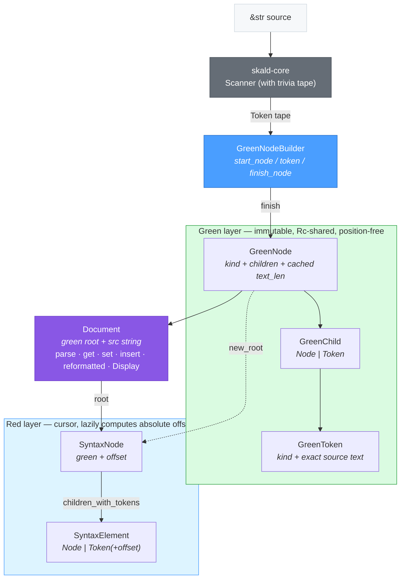

# skald-cst

**Skald lossless concrete syntax tree (CST) for comment-preserving edits.**

`skald-cst` is a lossless concrete syntax tree for YAML — a Roslyn /
rust-analyzer–style **green / red tree** that preserves *every byte* of the
original source: comments, blank lines, indentation, quoting style, trailing
whitespace, and line endings. Parsing a document and printing it back reproduces
the input byte-for-byte.

This is the deliberate counterpart to the **semantic** `Node` tree in
`skald-ast`. The AST is lossy by design — it captures *meaning* (mappings,
sequences, scalar values) and throws away trivia, so it is the right tool for
deserialization and emission. The CST keeps the trivia, so it is the right tool
for **surgical edits** that must leave the rest of the file untouched. It is the
editing substrate behind `skald-fmt` (safe formatter), `skald-lsp` (language
server), and `skald-mcp` (edit tools).

It depends only on `skald-core` (the shared scanner/parser front end) and is
`#![forbid(unsafe_code)]`.

## Package Structure

```text
src/
├── lib.rs        # Crate root; re-exports Document, SyntaxKind, builder, red-tree types
├── kind.rs       # SyntaxKind enum + is_token / is_trivia classifiers
├── green.rs      # Immutable, Rc-shared green tree: GreenNode, GreenToken, GreenChild
├── red.rs        # Red tree: SyntaxNode / SyntaxElement cursors with absolute offsets
├── builder.rs    # GreenNodeBuilder: start_node / token / finish_node / finish
└── document.rs   # Document — the editable API: parse, get, set, insert, reformatted, Display
```

## Architecture

The tree has two layers. The **green layer** is the immutable backing store:
position-free, `Rc`-shared, and cheap to clone (a pointer copy). The **red
layer** is a lightweight cursor over the green tree that lazily computes
absolute byte offsets during traversal — it stores no parent pointers, keeping
the structure acyclic and `unsafe`-free. `GreenNodeBuilder` constructs the green
tree; `Document` wraps a green root plus its source string and exposes the
editing API.



## Green / Red Tree

The two-layer design is the well-trodden lineage of Microsoft Roslyn and
rust-analyzer's `rowan`. Each layer earns its keep:

- **Green tree (`green.rs`)** — `GreenNode` and `GreenToken`, wrapped in `Rc`
  via `GreenChild`. Nodes are **immutable** and carry *no position*: a token
  only knows its `kind` and its exact `text`; a node knows its `kind`, its
  `children`, and a cached total `text_len()`. Because they are position-free
  and reference-counted, identical subtrees can be **structurally shared** and
  cloning is a pointer copy. This is what makes edits cheap — re-parsing reuses
  backing storage.
- **Red tree (`red.rs`)** — `SyntaxNode` is a *cursor*: a green node paired with
  its absolute start `offset`. Absolute byte offsets and `(start, end)` ranges
  are **computed lazily** while walking children
  (`children_with_tokens()` threads a running offset across the green node's
  children), so positions never have to be stored or invalidated on edit. No
  parent pointers are kept — navigation is downward only, which keeps the tree
  acyclic and the whole crate free of `unsafe`.

In short: green = cheap structural sharing and dedup; red = positions and
navigation on demand.

## Lossless Round-Trip

Losslessness holds *by construction*. `Document::parse` drains `skald-core`'s
trivia tape — with trivia enabled the token spans tile the entire input
byte-for-byte — and emits every byte-bearing token, sorted by start offset, as a
typed leaf under a single `Root` node. Any gap or malformed remainder is
captured as an `Error` leaf so no byte is ever dropped, and `parse` never panics
on bad input.

`Document` implements `std::fmt::Display`, so `to_string()` walks the green tree
and writes back the original source:

```rust
use skald_cst::Document;

let src = "# config\nname: skald   # trailing comment\nport: 8080\n";
let doc = Document::parse(src);

// Every byte survives — comments, spacing, and the trailing newline included.
assert_eq!(doc.to_string(), src);
```

This invariant is verified against the full official YAML test-suite corpus
(`corpus_lossless` in `document.rs`).

## Usage

`Document` is the high-level entry point: parse, read values by path, edit
in place while preserving surrounding trivia, then re-emit.

```rust
use skald_cst::Document;

let mut doc = Document::parse("version: 0.0.1  # keep me\nname: skald\n");

// Read a value by dotted/indexed path (exact source slice).
assert_eq!(doc.get("version").map(str::trim), Some("0.0.1"));

// Edit a single value — the trailing comment and spacing are untouched.
doc.set("version", "0.0.2").unwrap();
assert_eq!(doc.to_string(), "version: 0.0.2  # keep me\nname: skald\n");

// Insert a new top-level entry; existing content is preserved.
doc.insert("license", "MIT").unwrap();
assert_eq!(doc.get("license").map(str::trim), Some("MIT"));
```

For tooling that walks structure, the red tree exposes positioned cursors over
the green backing:

```rust
use skald_cst::{Document, SyntaxElement};

let doc = Document::parse("a: 1\nb: 2\n");
let root = doc.root();

// children_with_tokens() yields each leaf with its absolute byte range.
for el in root.children_with_tokens() {
    if let SyntaxElement::Token(tok, offset) = el {
        let _ = (tok.kind(), tok.text(), offset);
    }
}
```

To build a green tree directly (e.g. for tests or custom front ends), use
`GreenNodeBuilder` and wrap the result in a red cursor:

```rust
use skald_cst::{GreenNodeBuilder, SyntaxKind, SyntaxNode};

let mut b = GreenNodeBuilder::new();
b.start_node(SyntaxKind::Root);
b.token(SyntaxKind::ScalarToken, "key");
b.token(SyntaxKind::Punct, ": ");
b.token(SyntaxKind::ScalarToken, "value");
b.finish_node();

let root = SyntaxNode::new_root(b.finish());
assert_eq!(root.text(), "key: value");
assert_eq!(root.text_range(), (0, 10));
```

## Testing

### Integration Tests

The crate includes comprehensive integration tests that verify the core CST
properties: **byte-for-byte round-trip fidelity** and **surgical edit preservation**.

**Run all tests:**

```bash
cargo test -p skald-cst
```

**Run only integration tests:**

```bash
cargo test -p skald-cst --test integration
```

**With output:**

```bash
cargo test -p skald-cst --test integration -- --nocapture
```

### Test Coverage

The integration test suite (`tests/integration.rs`, 12 test cases) covers:

- **K8S manifests** — realistic Kubernetes-style config with comments, nested
  structure, and inline comments at multiple depths
- **Surgical edits** — replacing a single scalar value while leaving all other
  bytes (including neighboring comments and whitespace) untouched
- **Quote style preservation** — single and double quotes survive neighbor edits
- **Comment preservation** — inline comments and anchors/aliases stay in place
- **Multi-document streams** — editing one document in a multi-document file
- **Line-ending handling** — CRLF (`\r\n`) files round-trip correctly
- **BOM handling** — byte-order marks are preserved
- **Anchors and aliases** — YAML references survive unrelated edits
- **Block scalars** — literal (`|`) and folded (`>`) scalars are addressable
- **Flow collections** — empty objects (`{}`) and arrays (`[]`) are preserved
- **Type coercion** — `.value()` returns semantically correct types matching the
  canonical YAML loader

Each test verifies that `doc.to_string() == original_input` after parsing, and
that edits only change the target bytes.

## License

Licensed under either of [Apache-2.0](../LICENSE-APACHE-2.0) or
[MIT](../LICENSE-MIT) at your option.
