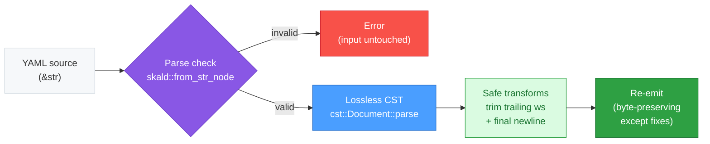

# skald-fmt

**CLI: format YAML safely (trailing-whitespace + final-newline), comment-preserving.**

`skald-fmt` is a deliberately **minimal, safe** YAML formatter. It applies only
provably-safe whitespace transforms — trimming trailing whitespace and ensuring
a single final newline — while preserving **every comment** and the document's
exact content and structure through the lossless [CST](../skald-cst). It is part
of the [Skald](../README.md) YAML 1.2.2 toolchain (zero `unsafe` by default).

Unlike opinionated formatters, `skald-fmt` will **not** reflow, re-indent,
re-quote, or restyle your YAML. If the input parses, the output is byte-for-byte
identical except for the targeted whitespace fixes. If the input does **not**
parse as valid YAML, `skald-fmt` refuses to touch it — a formatter must never
mangle unparseable input.

## Installation

Install from the workspace:

```sh
cargo install --path skald-fmt
```

Or run without installing, from the workspace root:

```sh
cargo run -p skald-fmt -- [FILES...] [--check] [--write]
```

## Usage

```text
usage: skald-fmt [FILES...] [--check] [--write]

  No files: read stdin, write formatted output to stdout.
  --write:  overwrite each file with its formatted output.
  --check:  exit 1 if any file is not already formatted.
  --check and --write are mutually exclusive.
```

### Modes

| Invocation                       | Behavior                                                            |
| -------------------------------- | ------------------------------------------------------------------ |
| `skald-fmt`                      | Read stdin, write formatted YAML to stdout.                        |
| `skald-fmt file.yaml ...`        | Write each file's formatted output to stdout (files unchanged).    |
| `skald-fmt --write file.yaml`    | Overwrite each file in place with its formatted output.            |
| `skald-fmt --check file.yaml`    | Report files that are not already formatted; exit 1 if any differ. |
| `skald-fmt -h` / `--help`        | Print usage and exit.                                              |

### Examples

Format a file to stdout (leaves the file untouched):

```sh
skald-fmt config.yaml
```

Format from a pipe:

```sh
cat config.yaml | skald-fmt > config.formatted.yaml
```

Fix files in place:

```sh
skald-fmt --write config.yaml deploy.yaml
```

Check formatting in CI (non-zero exit if any file needs formatting):

```sh
skald-fmt --check $(git ls-files '*.yaml' '*.yml')
```

`--check` prints `<path>: not formatted` to stderr for each file that would
change, and exits `1` so the command fails your pipeline. It never modifies
files.

> `--check` and `--write` are mutually exclusive; passing both exits `2`.

## What It Changes

`skald-fmt` applies only these safe transforms:

- **Trailing whitespace** — removes spaces and tabs at the end of every line.
- **Final newline** — ensures the document ends with exactly one trailing
  newline (no missing newline, no extra blank lines at EOF).

The formatter is **idempotent**: running it twice yields the same result as
running it once.

### What it does NOT change

To keep results trustworthy, `skald-fmt` never touches:

- **Comments** — every `#` comment is preserved verbatim, including inline
  comments and their spacing.
- **Quoting style** — plain, single-quoted, and double-quoted scalars are left
  exactly as written; nothing is re-quoted or unquoted.
- **Key order** — mapping keys keep their original order.
- **Indentation style** — indentation width and structure are preserved.
- **Content** — block scalars, flow collections, anchors, aliases, and tags are
  reproduced byte-for-byte.

In short: structure and content in, structure and content out — only stray
trailing whitespace and final-newline issues are corrected.

## Package Structure

```text
skald-fmt/
├── Cargo.toml      # crate manifest; depends on skald (ast + cst features)
└── src/
    ├── lib.rs      # format_str(): validate via parse, then reformat via CST
    └── main.rs     # CLI entry: arg parsing, stdin/file/check/write modes, exit codes
```

The CLI logic is split so the formatting core (`format_str`) is unit-testable
independently of the argument-parsing and I/O shell in `main.rs`.

## Architecture

`skald-fmt` first parses the input to confirm it is valid YAML (a guard against
mangling broken input), then builds a **lossless CST** and re-emits it with the
safe whitespace fixes applied. Because the CST records the source byte-for-byte,
re-emission is byte-preserving except for the targeted corrections.



## Exit Codes

| Code | Meaning                                                                                  |
| ---- | ---------------------------------------------------------------------------------------- |
| `0`  | Success. Formatting completed (stdin/stdout, files-to-stdout, or `--write`); or `--check` found all files already formatted; or `--help` was printed. |
| `1`  | `--check` only: at least one file is not formatted (each offending path printed to stderr). |
| `2`  | Usage or I/O error: unknown flag, `--check` and `--write` together, stdin/file read failure, file write failure, or invalid (unparseable) YAML. |

## License

Licensed under either of [Apache-2.0](../LICENSE-APACHE-2.0) or
[MIT](../LICENSE-MIT), at your option.
