# skald-fuzz

**Coverage-guided fuzz targets for the Skald YAML pipeline** — libFuzzer harnesses that prove panic-freedom, lossless round-trips, and resource-limit enforcement on adversarial input.

> **Dev-only.** This crate is **not** a workspace member. cargo-fuzz requires each fuzz crate to declare its own `[workspace]`, so `skald-fuzz/Cargo.toml` carries an empty `[workspace]` table and the root workspace excludes `crates/skald-fuzz`. It is never published (`publish = false`, `version = "0.0.0"`).

Skald is a safety-first YAML 1.2.2 library. The guarantee that matters most for a parser is that **no input can crash it** — a panic on attacker-controlled YAML is a denial-of-service. These targets continuously feed mutated bytes through the scanner, parser, composer, CST, and serde bridge to flush out panics, debug-assertion failures, infinite loops, and round-trip divergence before they reach a release.

## Prerequisites

Fuzzing requires the **nightly** toolchain (for `-Z sanitizer` instrumentation) and **cargo-fuzz**:

```sh
rustup toolchain install nightly
cargo install cargo-fuzz
```

## Running

All commands run from inside the crate directory. Pick a target and a time budget:

```sh
cd skald-fuzz
cargo +nightly fuzz run fuzz_scanner -- -max_total_time=60
```

The general pattern is:

```sh
cargo +nightly fuzz run <TARGET> -- -max_total_time=<SECONDS>
```

The eight targets:

```sh
cargo +nightly fuzz run fuzz_scanner       -- -max_total_time=60
cargo +nightly fuzz run fuzz_parser        -- -max_total_time=60
cargo +nightly fuzz run fuzz_round_trip    -- -max_total_time=60
cargo +nightly fuzz run fuzz_limits        -- -max_total_time=60
cargo +nightly fuzz run fuzz_serde         -- -max_total_time=60
cargo +nightly fuzz run fuzz_cst_roundtrip -- -max_total_time=60
cargo +nightly fuzz run fuzz_lossless_edit -- -max_total_time=60
cargo +nightly fuzz run fuzz_merge_keys    -- -max_total_time=60
```

List the available targets at any time with `cargo +nightly fuzz list`.

## Fuzz Targets

Every harness first attempts `std::str::from_utf8` and silently skips non-UTF-8 input — Skald's public API is `&str`, so invalid UTF-8 is out of scope.

| Target               | Input                          | Invariant checked                                                                                       |
| -------------------- | ------------------------------ | ------------------------------------------------------------------------------------------------------- |
| `fuzz_scanner`       | arbitrary UTF-8 → `Scanner`    | Tokenization never panics; a scan error is an acceptable outcome.                                        |
| `fuzz_parser`        | arbitrary UTF-8 → `Parser`     | Event production never panics; iteration always terminates (`Err`/`None` break the loop).               |
| `fuzz_round_trip`    | UTF-8 → `compose_all` → `emit` | Compose-then-emit never panics; an error at either stage is acceptable.                                  |
| `fuzz_limits`        | UTF-8 → `Composer` (tight)     | Under deliberately tiny `ResourceLimits` the composer never panics or OOMs — it returns an error first. |
| `fuzz_serde`         | UTF-8 → `from_str::<Value>`    | Deserialize → `to_string` → re-deserialize never panics on arbitrary input.                             |
| `fuzz_cst_roundtrip` | UTF-8 → `cst::Document::parse` | `parse(s).to_string() == s` — the lossless CST reproduces its input byte-for-byte (asserted).           |
| `fuzz_lossless_edit` | UTF-8 → CST `set` edits        | `set("a", …)` / nested `set("a.b.c", …)` never panic; the edited document re-parses losslessly.         |
| `fuzz_merge_keys`    | UTF-8 → `Composer` (merge on)  | Merge-key (`<<`) resolution is panic-free on arbitrary input (an error is acceptable).                  |

The `fuzz_limits` harness pins especially aggressive caps to exercise the rejection paths:

| Limit                  | Fuzz value |
| ---------------------- | ---------- |
| `max_depth`            | 4          |
| `max_alias_expansions` | 8          |
| `max_document_size`    | 4096       |
| `max_key_length`       | 64         |
| `max_node_count`       | 64         |

## Architecture

libFuzzer mutates a byte buffer and hands it to a target. The target drives one Skald stage and asserts the relevant invariant. The only acceptable terminal states are *survival* (clean return, possibly with an `Err`) — a panic, abort, hang, or failed assertion is a reported bug.

```mermaid
graph LR
    LF["libFuzzer<br/><i>mutated bytes</i>"] --> U8{"valid<br/>UTF-8?"}
    U8 -->|no| SKIP["skip"]
    U8 -->|"&str"| T

    subgraph T["Fuzz Targets → Stage Under Test"]
        direction TB
        SCAN["fuzz_scanner → Scanner"]
        PARSE["fuzz_parser → Parser"]
        RT["fuzz_round_trip → Composer + Emitter"]
        LIM["fuzz_limits → Composer (tight limits)"]
        SER["fuzz_serde → serde Value round-trip"]
        CST["fuzz_cst_roundtrip → CST Document"]
        EDIT["fuzz_lossless_edit → CST set()"]
        MERGE["fuzz_merge_keys → Composer (merge keys)"]
    end

    T --> CHECK{"outcome"}
    CHECK -->|"no panic /<br/>stable round-trip /<br/>limits hold"| OK["survives ✓"]
    CHECK -->|"panic · abort ·<br/>hang · assert!"| BUG["crash = bug found"]

    style LF fill:#656d76,color:#fff,stroke:#484f58
    style U8 fill:#f6f8fa,stroke:#d1d9e0
    style SKIP fill:#f6f8fa,stroke:#d1d9e0
    style CHECK fill:#f6f8fa,stroke:#d1d9e0
    style OK fill:#2ea043,color:#fff,stroke:#1a7431
    style BUG fill:#f85149,color:#fff,stroke:#cf222e
```



## Corpus

Inputs live under `corpus/`, with one subdirectory per target plus a shared starter set:

- `corpus/seed/` — 10 hand-picked seeds covering the YAML surface area: basic mappings, flow collections, block scalars, anchors/aliases, multi-document streams, and a few official test-suite cases (`229Q`, `2AUY`, `6ZKB`, `8UDB`, `A2M4`). Copy or symlink these into a target's corpus to give the mutator a head start.
- `corpus/fuzz_cst_roundtrip/`, `corpus/fuzz_lossless_edit/`, `corpus/fuzz_merge_keys/` — accumulated, coverage-expanding corpora grown by prior runs (libFuzzer auto-minimizes and persists interesting inputs here).

Any crash-reproducing input is written to `artifacts/<target>/` so it can be replayed deterministically:

```sh
cargo +nightly fuzz run <TARGET> artifacts/<TARGET>/<crash-file>
```

## Why Not a Workspace Member

cargo-fuzz builds its targets with sanitizer instrumentation and its own profile settings, which it controls via the fuzz crate's *own* `[workspace]` root. If `skald-fuzz` were a member of the main workspace, those settings would either conflict with the library build or fail to apply. The conventional fix — and what Skald does — is:

1. `skald-fuzz/Cargo.toml` declares an empty `[workspace]` table, making it a standalone workspace root.
2. The repository's virtual root manifest lists `exclude = ["crates/skald-fuzz"]`.

As a result `cargo build --workspace`, `cargo test --workspace`, and the coverage gate never touch this crate; it is driven exclusively through `cargo +nightly fuzz`.
