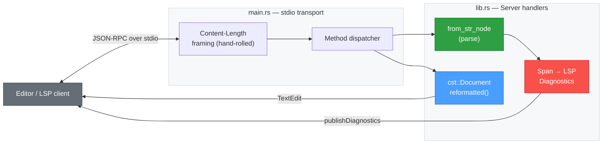

# skald-lsp

**Minimal YAML Language Server (diagnostics + formatting) over stdio.**

`skald-lsp` is a tiny, dependency-light Language Server for YAML. It speaks the
Language Server Protocol over stdio with a **hand-rolled, synchronous JSON-RPC
loop** — no async runtime, no `tokio`, no `lsp-server` crate. Its only
dependencies are the `skald` facade (with the `ast` + `cst` features) and
`serde_json`.

It provides two things editors care about most for YAML: **live parse
diagnostics** as you open and edit a document, and **whole-document formatting**
— both powered directly by Skald's parser and lossless CST.

## Capabilities

The server advertises a small, honest capability set during `initialize`:

```json
{ "textDocumentSync": 1, "documentFormattingProvider": true }
```

`textDocumentSync: 1` is **Full** sync — the client sends the complete document
text on every change.

Implemented:

| LSP method                         | Kind         | Behavior                                                        |
| ---------------------------------- | ------------ | -------------------------------------------------------------- |
| `initialize`                       | request      | Returns the capabilities above.                                |
| `initialized`                      | notification | Accepted, no-op.                                               |
| `shutdown`                         | request      | Returns `null`.                                                |
| `exit`                             | notification | Terminates the process.                                        |
| `textDocument/didOpen`             | notification | Stores the document, then publishes diagnostics.               |
| `textDocument/didChange`           | notification | Replaces stored text (full sync), then re-publishes.           |
| `textDocument/formatting`          | request      | Returns a single full-document `TextEdit` with reformatted text. |
| `textDocument/publishDiagnostics`  | server → client | Emitted after every open/change with parse errors (or empty). |

Not implemented (by design — this is a focused server, not a full IDE backend):

- No completion, hover, or signature help.
- No go-to-definition, references, or symbols.
- No range/on-type formatting (whole-document formatting only).
- No incremental sync (`textDocumentSync` is Full, not Incremental).
- Unknown **requests** return a `null` result; unknown **notifications** are
  silently ignored.

## Architecture

The editor and server exchange `Content-Length`-framed JSON-RPC messages over
stdin/stdout. `main.rs` owns the byte-level transport loop; `lib.rs` owns the
transport-agnostic dispatcher and handlers.



The `Server` keeps a `HashMap<String, String>` of open documents (URI → full
text). Diagnostics are produced by attempting a parse with `skald::from_str_node`
and converting any error span into an LSP `Diagnostic`. Formatting is produced
by parsing the stored text into Skald's lossless CST (`skald::cst::Document`) and
emitting `reformatted()` output as a single full-range `TextEdit`.

## Package Structure

```text
src/
├── lib.rs    Server state + handle() dispatcher, diagnostics, formatting, frame()
└── main.rs   Stdio loop: read Content-Length headers, decode body, write framed replies
```

- **`lib.rs`** — `Server` (open-document map), the `handle(method, id, params)`
  dispatcher, `Outgoing` (Response / Notification), Span→Range diagnostics, CST
  formatting, and the `frame()` `Content-Length` helper. Pure and unit-tested;
  no I/O.
- **`main.rs`** — the only side-effecting code: a blocking `stdin`/`stdout` loop
  that reads byte-by-byte until `\r\n\r\n`, parses `Content-Length`, decodes the
  JSON body, calls `Server::handle`, and writes framed responses.

## Editor Setup

`skald-lsp` is a plain stdio server: launch the binary and pipe JSON-RPC. Point
any LSP client at the compiled binary.

Build it:

```sh
cargo build --release -p skald-lsp
# binary at target/release/skald-lsp
```

**Neovim** (built-in `vim.lsp`, editor-agnostic — no plugin required):

```lua
vim.api.nvim_create_autocmd("FileType", {
  pattern = "yaml",
  callback = function(args)
    vim.lsp.start({
      name = "skald-lsp",
      cmd = { "/path/to/target/release/skald-lsp" },
      root_dir = vim.fs.dirname(args.file),
    })
  end,
})
```

**VS Code** — any generic LSP client extension can spawn the binary with the
transport set to stdio:

```jsonc
{
  "command": "/path/to/target/release/skald-lsp",
  "args": [],
  "transport": "stdio",
  "documentSelector": [{ "language": "yaml" }]
}
```

Once connected, the server publishes diagnostics on open/change and responds to
"Format Document" with a full-document edit.

## Diagnostics Mapping

Skald reports source locations with a `Span`, where `Position.line` and
`Position.column` are both **1-based**. LSP `Position` fields are both
**0-based**. The handler converts by subtracting one (saturating at zero) from
each:

```rust
let (line, ch) = e.span.map_or((0, 0), |s| (
    u64::from(s.start.line.saturating_sub(1)),
    u64::from(s.start.column.saturating_sub(1)),
));
```

The resulting diagnostic spans a single character at the error start:

- `range.start` = `{ line, character: ch }`
- `range.end`   = `{ line, character: ch + 1 }`
- `severity`    = `1` (Error)
- `source`      = `"skald"`
- `message`     = the Skald error's `Display` text

When the document parses cleanly, an empty `diagnostics` array is published,
clearing any prior errors in the editor.

## License

Licensed under either of [Apache License, Version 2.0](../LICENSE-APACHE-2.0) or
[MIT License](../LICENSE-MIT).
