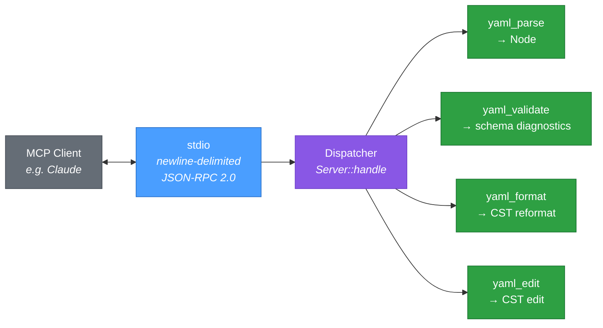

# skald-mcp

**MCP server exposing parse, validate, edit, and format tools for YAML.**

`skald-mcp` lets MCP clients (e.g. Claude) parse, validate, format, and edit YAML through [Skald](../README.md) — including comment-preserving edits backed by the lossless CST. It speaks the [Model Context Protocol](https://modelcontextprotocol.io/) over **synchronous, newline-delimited JSON-RPC 2.0 on stdio** (one JSON object per `\n`). There is **no async runtime** — the server reads a line, dispatches it, writes the response, and flushes, all on a single thread.

## Tools

Each tool is invoked via `tools/call` with a `name` and an `arguments` object. Results are returned in the MCP content envelope (`{ "content": [{ "type": "text", "text": ... }], "isError": ... }`).

| Tool            | Parameters                        | Returns                                                                                                     |
| --------------- | --------------------------------- | ---------------------------------------------------------------------------------------------------------- |
| `yaml_parse`    | `text`                            | `"valid"` on success; otherwise the parse error prefixed with `line:column` and `isError: true`.            |
| `yaml_validate` | `text`, `schema`                  | A JSON array of span-anchored diagnostics (`path`, `line`, `column`, `message`); empty array when valid.    |
| `yaml_format`   | `text`                            | The reformatted YAML (trailing-whitespace trim + final newline), comments preserved; parse error otherwise. |
| `yaml_edit`     | `text`, `path`, `value`           | The edited YAML with the scalar at the dotted `path` set to `value`; inserts a top-level key if absent.     |

All parameters are strings. `yaml_validate`'s `schema` is a JSON Schema supplied as a YAML or JSON string.

**Comment-preserving edits:** `yaml_edit` (and `yaml_format`) operate on Skald's lossless CST (`skald::cst::Document`), so comments, key order, and surrounding formatting survive the edit. `yaml_edit` first attempts `Document::set(path, value)`; if the path is not found and it is a single (non-dotted) top-level key, it falls back to `Document::insert(path, value)`.

## Architecture



`yaml_parse` and `yaml_validate` route through the `skald` node/schema API (`from_str_node`, `schema::validate`); `yaml_format` and `yaml_edit` route through the comment-preserving CST (`skald::cst::Document`).

## Package Structure

```
src/
├── lib.rs    # Server dispatch, tool registry/schemas, JSON-RPC framing, tool implementations
└── main.rs   # stdio read loop: parse line → Server::handle → write framed responses → flush
```

## Configuration

Register the built `skald-mcp` binary with any MCP client that supports stdio servers (generic `mcpServers` form):

```json
{
  "mcpServers": {
    "skald": {
      "command": "/absolute/path/to/skald-mcp",
      "args": []
    }
  }
}
```

Build the binary with `cargo build --release -p skald-mcp`; it then lives at `target/release/skald-mcp`. The server communicates over the client-provided stdin/stdout pipe — no ports, sockets, or environment variables are required.

## Protocol

Transport is newline-delimited JSON-RPC 2.0 over stdio (one JSON object per line — note this differs from LSP's `Content-Length` header framing). The server handles:

| Method                       | Behavior                                                                                  |
| ---------------------------- | ----------------------------------------------------------------------------------------- |
| `initialize`                 | Returns `protocolVersion` `2024-11-05`, `capabilities.tools`, and `serverInfo`.           |
| `notifications/initialized`  | Acknowledged silently (no response).                                                      |
| `ping`                       | Returns an empty result object `{}`.                                                       |
| `tools/list`                 | Returns the four tools with their `name`, `description`, and `inputSchema`.                |
| `tools/call`                 | Dispatches to the named tool and returns its content envelope.                            |
| `exit`                       | Terminates the read loop after responding.                                                |

Unknown **requests** (those with an `id`) receive a JSON-RPC error with code `-32601` (method not found); unknown **notifications** (no `id`) are ignored. Malformed JSON lines yield a `-32700` (parse error) response.
