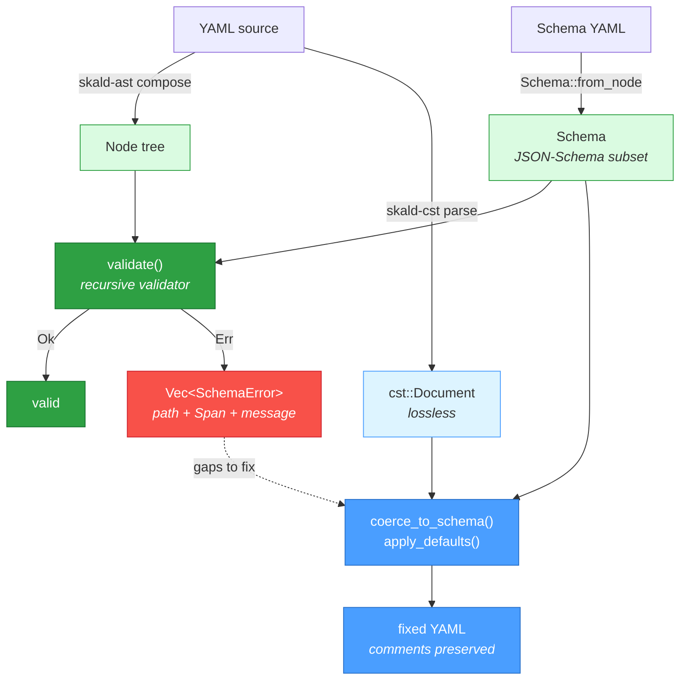

# skald-schema

**Hand-rolled, Span-anchored JSON-Schema validation over the Skald `Node` tree.**

`skald-schema` validates a YAML document — represented as a Skald `Node` tree —
against a JSON-Schema (a subset of draft 2020-12), reporting every violation with
a **`Span`** that points back to the exact offending location in the source. It
can also **autofix** documents: coercing scalar values to their declared types and
inserting missing `default`s while **preserving comments and formatting**, because
the fixes are applied over the lossless CST (`skald-cst`), not the AST.

It depends on `skald-core` (`Span`), `skald-ast` (the `Node` tree it validates),
and `skald-cst` (the lossless `Document` it edits). The crate is
`#![forbid(unsafe_code)]` with `#![deny(missing_docs)]`.

This crate powers the `skald-validate` CLI (`--fix` autofix) and the
`yaml_validate` tool exposed by `skald-mcp`.

## Package Structure

```text
src/
├── lib.rs       # Crate root + re-exports (Schema, JsonType, validate, SchemaError,
│                #   coerce_to_schema, apply_defaults, Coercion, Insertion)
├── schema.rs    # The parsed Schema model + Schema::from_node (Node -> Schema)
├── validate.rs  # validate(): recursive Span-anchored validation -> Vec<SchemaError>
└── coerce.rs    # CST autofix: coerce_to_schema() + apply_defaults() over a Document
```

## Architecture

Validation reads from the AST; coercion writes to the CST. The two paths share the
same `Schema` model but operate on different representations — validation needs the
typed `Node` tree, while autofix needs the lossless `Document` so it can edit values
without disturbing comments or whitespace.



## Validation

A `Schema` is built from a schema-document `Node` via `Schema::from_node`. A
non-mapping schema node yields an empty (accept-all) schema, and **unknown keywords
are silently ignored** — so a fuller draft 2020-12 document still validates, it just
enforces the supported subset.

Supported keywords (`schema.rs` / `validate.rs`):

| Category | Keywords |
| -------- | -------- |
| Types | `type` (single or list; `integer` satisfies `number`) |
| Objects | `required`, `properties`, `additionalProperties` (only `false` is enforced), `minProperties`, `maxProperties` |
| Arrays | `items`, `minItems`, `maxItems` |
| Scalars | `enum`, `const`, `minimum`, `maximum`, `minLength`, `maxLength` |
| Autofix | `default` (scalar defaults; object/array defaults ignored) |

`validate(data: &Node, schema: &Schema) -> Result<(), Vec<SchemaError>>` walks the
node tree recursively and collects **all** violations (it does not stop at the
first). On a type mismatch for a given node it returns early for that node, since
further keyword checks against the wrong type would be noisy.

Every violation is a `SchemaError`, and **every error carries a `Span`** anchored to
the offending node, so callers can map failures back to precise source locations:

```rust
pub struct SchemaError {
    pub path: String,   // JSON-pointer-style, e.g. "/items/0/age"
    pub span: Span,     // source span of the offending node
    pub message: String,
}
```

Scalar typing is inferred from text: `null`/`~`/empty map to `null`, the usual
`true`/`false` spellings to `boolean`, then `i64`-parseable to `integer`,
`f64`-parseable to `number`, otherwise `string`.

## Autofix / Coercion

Autofix runs over the **CST `Document`**, not the AST. That is deliberate: the CST is
lossless, so editing a scalar's text leaves every surrounding comment, blank line,
and indentation choice untouched. Both functions take `&mut Document` and return a
record of what they changed.

**`coerce_to_schema(doc, schema) -> Vec<Coercion>`** — rewrites scalar leaves to the
canonical form of their declared type:

- **Type coercion** — `"8080"` -> `8080` for `integer`, `True` -> `true` for
  `boolean`, `123` -> `"123"` for `string` (quotes a value that would otherwise read
  as a number/bool/null). `number` normalizes via `f64` parse.
- **Multi-type schemas** — `type: [integer, string]` tries each declared type in
  order and applies the **first** that coerces; a non-numeric string under that
  schema is left alone.
- **Nested insertion / recursion** — recurses into declared `properties` and walks
  `items` for arrays (by index, until the first missing index), including top-level
  arrays and arrays of objects. Already-canonical values produce no `Coercion`.

Each applied change is a `Coercion { path, from, to }`.

**`apply_defaults(doc, schema) -> Vec<Insertion>`** — inserts properties that declare
a scalar `default` and are absent from the document. It recurses into nested object
subschemas **only when the parent key is already present** (it will not materialize a
whole missing subtree just to seat a default), editing the CST comment-preservingly.
Each insertion is an `Insertion { path, value }`.

## Usage

```rust
use skald_ast::composer::Composer;
use skald_schema::{Schema, validate};

// 1. Parse a JSON-Schema (itself written as YAML) into a Schema.
let schema_node = Composer::new(
    "type: object\n\
     required: [name]\n\
     properties:\n\
     \x20 name: {type: string}\n\
     \x20 age:  {type: integer, minimum: 0}\n",
)
.next()
.unwrap()
.unwrap()
.into_owned();
let schema = Schema::from_node(&schema_node);

// 2. Parse the data document into a Node tree.
let data = Composer::new("name: alice\nage: not-a-number\n")
    .next()
    .unwrap()
    .unwrap()
    .into_owned();

// 3. Validate and inspect Span-anchored errors.
match validate(&data, &schema) {
    Ok(()) => println!("valid"),
    Err(errors) => {
        for e in errors {
            // e.span points at the exact offending node in the source.
            println!(
                "{} (line {}, col {}): {}",
                e.path, e.span.start.line, e.span.start.column, e.message
            );
        }
    }
}
```

### Autofix while preserving comments

```rust
use skald_ast::composer::Composer;
use skald_cst::Document;
use skald_schema::{Schema, apply_defaults, coerce_to_schema};

let schema_node = Composer::new(
    "type: object\n\
     properties:\n\
     \x20 port: {type: integer, default: 8080}\n\
     \x20 host: {type: string}\n",
)
.next()
.unwrap()
.unwrap()
.into_owned();
let schema = Schema::from_node(&schema_node);

let mut doc = Document::parse("host: \"example.com\"  # keep this comment\n");

let coercions = coerce_to_schema(&mut doc, &schema); // (none here)
let insertions = apply_defaults(&mut doc, &schema);  // inserts port: 8080

assert_eq!(insertions.len(), 1);
assert_eq!(insertions[0].path, "port");
// The trailing comment survives the edit:
assert_eq!(
    doc.to_string(),
    "host: \"example.com\"  # keep this comment\nport: 8080\n"
);
let _ = coercions;
```

## License

Licensed under either of [Apache-2.0](../LICENSE-APACHE-2.0) or
[MIT](../LICENSE-MIT) at your option.
