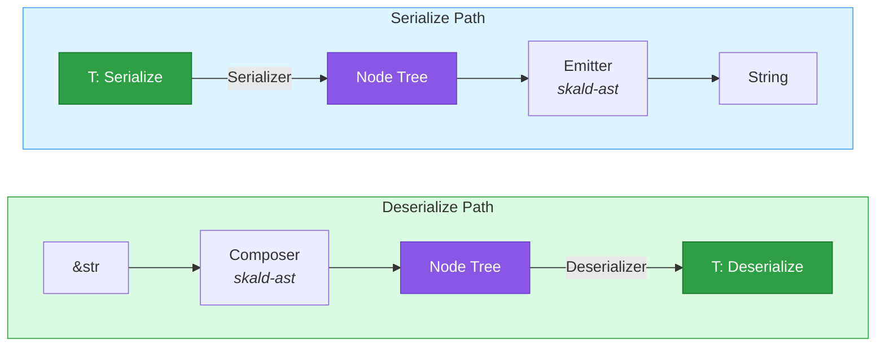
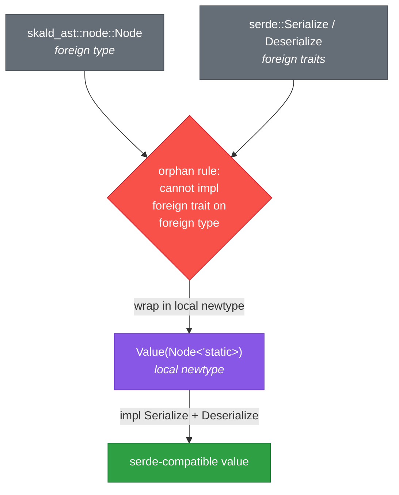

# skald-serde

**Serde integration for the skald YAML library.**

`skald-serde` bridges Skald's YAML pipeline to serde's `Serialize` and
`Deserialize` traits. It walks a composed `Node` tree to drive serde's visitor
protocol on deserialize, and builds a `Node` tree from serde data-model calls
on serialize before handing it to the emitter.

This crate is the engine behind the `skald` facade's clean `from_str` /
`to_string` functions. **Most users should depend on the `skald` facade, not on
`skald-serde` directly** — the facade re-exports these functions under tidy
names and wires the node API alongside them. Depend on `skald-serde` directly
only when you want the serde bridge without the rest of the facade.

## Package Structure

```text
src/
├── lib.rs       # Crate root: re-exports the public surface (from_str, to_string, Value, …)
├── de.rs        # Deserializer: Node tree → serde Visitor protocol → T (incl. SWAR integer fast path)
├── ser.rs       # Serializer: T → Node tree → emitter; needs_quoting() drives scalar quoting
├── value.rs     # Value(Node<'static>) newtype with Serialize + Deserialize impls
├── borrowed.rs  # BorrowedValue<'a>(Node<'a>): zero-copy borrowed value over the input
├── styled.rs    # Per-value output-style wrappers: FlowSeq, FlowMap, LitStr, FoldStr
└── error.rs     # Error/Result: bridges skald-core errors to serde's error traits
```

## Architecture

The serde bridge sits between the YAML pipeline (scanner → parser → composer →
emitter, all in `skald-core` / `skald-ast`) and serde's data model. The `Node`
tree is the meeting point in both directions.



The `Value` newtype is what makes a `Node` usable as a serde value. Skald's
`Node` lives in `skald-ast`, and serde's `Serialize` / `Deserialize` traits
live in the `serde` crate — both foreign to this crate. Rust's **orphan rule**
forbids implementing a foreign trait on a foreign type, so we wrap `Node` in a
local newtype and implement the traits on the wrapper instead.



## Value Bridge

`Value(Node<'static>)` (`value.rs`) is the dynamic, schema-less YAML value type.
It wraps an owned `Node<'static>` and carries the `Serialize` + `Deserialize`
implementations that the orphan rule prevents us from placing on `Node`
directly. Convert with `Value::new(node)` / `Value::from(node)` and
`value.into_node()` / `value.as_node()`; `Value` also `Deref`s to its inner
`Node`. Custom tags (e.g. `!mytag`) are preserved verbatim on the node path and
surfaced through `Value::tag()` — Skald never maps a tag to a code path.

Two companions specialize the bridge:

- **`BorrowedValue<'a>` (`borrowed.rs`)** — the zero-copy parallel to `Value`.
  It wraps `Node<'a>` whose scalar slices point directly into the source string,
  so plain, unescaped scalars are borrowed with no heap allocation (only scalars
  that need transformation — escapes, block-scalar folding — allocate). Use
  `BorrowedValue::parse(&input)` for short-lived parsing where you can hold the
  input alive; reach for `Value` when you need `'static`, long-lived data you
  can send across threads.

- **`styled.rs`** — per-value control over scalar and collection rendering on
  serialize. Wrap a value in `FlowSeq` / `FlowMap` to force flow style
  (`[a, b]` / `{k: v}`), or a string in `LitStr` / `FoldStr` to emit a literal
  (`|`) or folded (`>`) block scalar. Each wrapper carries its intent through
  serde via a reserved newtype-struct name that the serializer intercepts.

## Design Notes

- **`needs_quoting()` controls emitter quoting** — the emitter trusts the
  caller's `ScalarStyle` and emits plain scalars unquoted. The serializer
  decides quoting up front: `needs_quoting()` in `ser.rs` detects strings that
  would otherwise resolve to `null`/`bool`/numbers or that contain
  YAML-significant punctuation, and renders those as double-quoted scalars so
  round-trips stay lossless.
- **Cow zero-copy** — scalar text rides on `Cow<'a, str>`. On the borrowed path
  (`BorrowedValue`) plain scalars stay `Cow::Borrowed` into the input;
  serialization uses `Cow::Borrowed(&'static str)` for constants like `.nan`,
  `.inf`, and `0.0` to avoid allocating well-known tokens.
- **SWAR integer fast path** — `de.rs` parses ASCII decimal digit runs into
  `u64` using safe "SIMD Within A Register" bit tricks (no `unsafe`, no
  `std::arch`), keeping integer-heavy documents cheap.
- **Error bridge** — `error.rs` wraps either a `skald_core::error::Error` (parse
  / compose failures, with span) or a serde `Custom(String)` message (e.g.
  "missing field `name`"), implementing both `serde::de::Error` and
  `serde::ser::Error`. `Error::as_core()` recovers the underlying core error
  when present.

This crate sets `#![forbid(unsafe_code)]` — no exceptions.

## Usage

The public functions below are exported directly from `skald_serde`. The
`skald` facade re-exports the same functions under identical names; prefer the
facade in application code.

### Deserialize

```rust
use serde::Deserialize;

#[derive(Deserialize)]
struct Config {
    name: String,
    debug: bool,
}

let config: Config = skald_serde::from_str("name: skald\ndebug: true\n").unwrap();
assert_eq!(config.name, "skald");
assert!(config.debug);
```

### Serialize

```rust
use serde::Serialize;

#[derive(Serialize)]
struct Point { x: i32, y: i32 }

let yaml = skald_serde::to_string(&Point { x: 1, y: 2 }).unwrap();
assert_eq!(yaml, "x: 1\ny: 2\n");
```

### Dynamic `Value`

```rust
let value: skald_serde::Value = skald_serde::from_str("name: skald\n").unwrap();
assert!(value.is_mapping());

let yaml = skald_serde::to_string(&value).unwrap();
assert!(yaml.contains("name: skald"));
```

### Zero-copy `BorrowedValue`

```rust
use skald_serde::BorrowedValue;

let input = String::from("hello");
let bv = BorrowedValue::parse(&input).unwrap();
assert_eq!(bv.as_str(), Some("hello"));
```

### Styled serialization

```rust
use serde::Serialize;
use skald_serde::{FlowSeq, LitStr};

#[derive(Serialize)]
struct Doc {
    tags: FlowSeq<Vec<&'static str>>,
    script: LitStr<&'static str>,
}

let yaml = skald_serde::to_string(&Doc {
    tags: FlowSeq(vec!["yaml", "rust"]),
    script: LitStr("line one\nline two\n"),
}).unwrap();
// tags: [yaml, rust]
// script: |
//   line one
//   line two
```

### Multi-document streams

```rust
let docs: Vec<String> = skald_serde::from_str_multi("---\nfirst\n---\nsecond\n").unwrap();
assert_eq!(docs, ["first", "second"]);
```

### Configured variants

Each entry point has a `*_with` companion that takes explicit configuration:

| Function | Config argument | Purpose |
| --- | --- | --- |
| `from_str_with` / `from_reader_with` / `from_str_multi_with` | `skald_core::error::ParserConfig` | parser limits, YAML 1.1 bool/null compatibility |
| `to_string_with` / `to_writer_with` | `&skald_ast::emitter::EmitterConfig` | indentation, key sorting, explicit `---` markers |

```rust
use serde::Serialize;
use skald_ast::emitter::EmitterConfig;

#[derive(Serialize)]
struct Data { b: i32, a: i32 }

let config = EmitterConfig { sort_keys: true, ..EmitterConfig::default() };
let yaml = skald_serde::to_string_with(&Data { b: 2, a: 1 }, &config).unwrap();
assert_eq!(yaml, "a: 1\nb: 2\n");
```

## License

Licensed under either of Apache-2.0 or MIT at your option.
