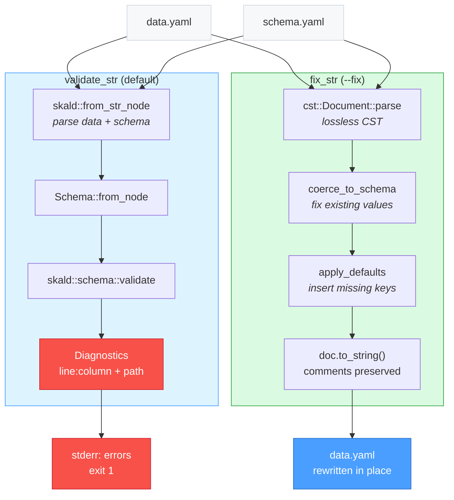

# skald-validate

**CLI: validate YAML against a JSON-Schema with comment-preserving autofix.**

`skald-validate` checks a YAML data file against a JSON-Schema (itself written in
YAML or JSON) and reports each violation with a precise `line:column` location and
a JSON-pointer path. With `--fix`, it rewrites the data file in place — coercing
mismatched scalar types and inserting missing defaults — while preserving every
comment, blank line, and quoting style through Skald's lossless CST.

Built on the [`skald`](../skald) facade's `schema` feature
(`skald::schema::{Schema, validate, coerce_to_schema, apply_defaults}`).

## Installation

Install the binary from the workspace:

```sh
cargo install --path skald-validate
```

Or run it without installing, straight from the workspace:

```sh
cargo run -p skald-validate -- <data.yaml> --schema <schema.yaml> [--fix]
```

## Usage

```text
skald-validate <data.yaml> --schema <schema.yaml> [--fix]

Arguments:
  <data.yaml>            Path to the YAML data file to validate (positional, required)

Options:
  -s, --schema <path>    Path to the JSON-Schema file (YAML or JSON) (required)
      --fix              Apply comment-preserving autofix and write back in place
  -h, --help             Print usage and exit 0
```

Notes on behavior (from `main.rs`):

- The data file is the first positional argument; `--schema`/`-s` is required.
- Diagnostics and the report are written to **stderr**, not stdout.
- `--fix` overwrites the data file in place and always exits `0` on success
  (it reports how many coercions and insertions were applied, rather than
  failing on findings).

### Validate (success)

```sh
$ skald-validate config.yaml --schema schema.yaml
config.yaml: valid
$ echo $?
0
```

### Validate (failures)

Each violation is printed as `file:line:column: message (json-pointer-path)`,
and the process exits non-zero:

```sh
$ skald-validate config.yaml --schema schema.yaml
config.yaml:3:7: expected integer, found string (/age)
config.yaml:1:1: required property "name" is missing (/)
$ echo $?
1
```

### Autofix (`--fix`)

Coerces existing values to the schema's types and inserts missing defaults,
writing the result back to the data file. Comments and formatting survive:

```sh
$ cat config.yaml
host: "example"  # the host
$ skald-validate config.yaml --schema schema.yaml --fix
1 coercion(s), 1 insertion(s)
$ cat config.yaml
host: "example"  # the host
port: 8080
```

If the schema cannot be parsed, `--fix` is a guaranteed no-op: the data file is
left byte-for-byte unchanged and the report notes the schema parse error — your
data is never corrupted.

## Package Structure

```text
skald-validate/
├── Cargo.toml          # binary crate; depends on skald (schema feature)
└── src/
    ├── lib.rs          # core logic: validate_str() + fix_str() (string in, data out — unit-tested)
    └── main.rs         # CLI entry: arg parsing, file I/O, exit codes
```

The logic lives in `lib.rs` as pure string-to-data functions (`validate_str`,
`fix_str`) so it is unit-testable without touching the filesystem; `main.rs` is a
thin shell that handles argument parsing, file I/O, and exit codes.

## Architecture



In validate mode, both inputs are parsed to `Node` trees; the schema becomes a
`Schema`, and `validate` returns a list of errors carrying spans and JSON-pointer
paths. In `--fix` mode, the data is parsed into a lossless `cst::Document`;
`coerce_to_schema` runs first (repairing existing values), then `apply_defaults`
(adding missing keys), both mutating the **same** CST so comments and layout are
preserved end-to-end before the document is serialized back.

## Exit Codes

| Code | Meaning                                                                      |
| ---- | --------------------------------------------------------------------------- |
| `0`  | Valid (no diagnostics), `--fix` completed, or `--help` printed              |
| `1`  | Validation failed — one or more schema violations were reported to stderr   |
| `2`  | Usage error — missing/unexpected argument, or a file could not be read/written |
