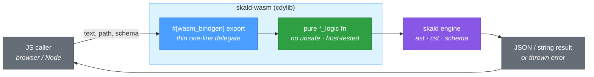

# skald-wasm

**WebAssembly (wasm-bindgen) bindings for Skald: parse/format/validate/edit YAML in the browser or Node.**

`skald-wasm` exposes Skald's safety-first YAML 1.2.2 engine to JavaScript. Compile it to a WebAssembly module and call `yaml_parse`, `yaml_format`, `yaml_validate`, and `yaml_edit` directly from the browser (ESM) or Node — no native YAML dependency, the same engine that passes 100% of the official YAML test suite.

## Building

The crate is a `cdylib` (plus `rlib` for host unit tests). Build the WebAssembly artifact with [`wasm-pack`](https://rustwasm.github.io/wasm-pack/):

```sh
# Browser / ESM bundlers (generates an importable ES module)
wasm-pack build skald-wasm --target web

# Node.js (CommonJS)
wasm-pack build skald-wasm --target nodejs

# Bundler-pipeline (webpack/rollup)
wasm-pack build skald-wasm --target bundler
```

Each command emits a `pkg/` directory containing the `.wasm` binary and the generated JavaScript/TypeScript glue.

Prefer the raw toolchain? Build with `cargo` + `wasm-bindgen-cli`:

```sh
cargo build -p skald-wasm --target wasm32-unknown-unknown --release
wasm-bindgen target/wasm32-unknown-unknown/release/skald_wasm.wasm \
  --out-dir pkg --target web
```

The pure-logic functions are host-testable without any wasm target:

```sh
cargo test -p skald-wasm
```

## API

All functions are exported via `#[wasm_bindgen]`. A returned `Result::Err` surfaces in JavaScript as a **thrown exception** (the error string); `Ok` becomes the resolved value.

| Function       | Params                                       | Returns                                                                                  |
| -------------- | -------------------------------------------- | ---------------------------------------------------------------------------------------- |
| `yaml_parse`   | `text: string`                               | `undefined` if `text` is valid YAML; **throws** the parse error (with `line:column`) otherwise |
| `yaml_format`  | `text: string`                               | Formatted YAML `string` (trailing-whitespace trim + final newline, comments preserved); **throws** on invalid YAML |
| `yaml_validate`| `text: string, schema: string`               | JSON-array `string` of diagnostics (`[]` = valid); **throws** if either input fails to parse |
| `yaml_edit`    | `text: string, path: string, value: string`  | New document `string` with the scalar at dotted `path` set to `value` (inserts a top-level key when `path` is absent and has no `.`); **throws** on a structural error |
| `version`      | _(none)_                                     | The `skald-wasm` package version `string`                                                 |

Each `yaml_validate` diagnostic is a JSON object of the form:

```json
{ "path": "age", "line": 1, "column": 0, "message": "expected integer" }
```

## Usage

### Browser (ESM)

```js
import init, {
  yaml_parse,
  yaml_format,
  yaml_validate,
  yaml_edit,
  version,
} from "./pkg/skald_wasm.js";

await init(); // load and instantiate the .wasm module

console.log(version()); // "0.1.0"

// Parse: throws on invalid YAML, returns undefined when valid
try {
  yaml_parse("a: [1, 2\n");
} catch (err) {
  console.error("invalid YAML:", err); // "1:3 ..."
}

// Format: trims trailing whitespace, keeps comments
const tidy = yaml_format("a: 1   # keep\nb: 2\n");
console.log(tidy); // "a: 1   # keep\nb: 2\n"

// Edit: set a dotted path, comment-preserving
const edited = yaml_edit("a: 1  # keep\nb: 2\n", "a", "9");
console.log(edited); // "a: 9  # keep\nb: 2\n"
```

### Node.js

```js
const { yaml_validate } = require("./pkg/skald_wasm.js");

const schema = "type: object\nproperties:\n  age: {type: integer}\n";

const diags = JSON.parse(yaml_validate("age: notnum\n", schema));
console.log(diags.length); // 1
console.log(diags[0].message);

const ok = JSON.parse(yaml_validate("age: 7\n", schema));
console.log(ok.length); // 0  → valid
```

## Architecture

`skald-wasm` keeps every `#[wasm_bindgen]` export a **one-line delegate** to a pure `*_logic` function. The logic functions contain no `unsafe` and no wasm dependency, so they are unit-tested on the host. The wasm layer only marshals strings across the ABI boundary.



| Export          | Delegates to     | Engine surface used                                  |
| --------------- | ---------------- | ---------------------------------------------------- |
| `yaml_parse`    | `parse_logic`    | `skald::from_str_node`                               |
| `yaml_format`   | `format_logic`   | `skald::from_str_node` + `skald::cst::Document`      |
| `yaml_validate` | `validate_logic` | `skald::schema::{Schema, validate}` + `serde_json`   |
| `yaml_edit`     | `edit_logic`     | `skald::cst::Document` (`set` / `insert`)            |

## Safety

`skald-wasm` is the **only** crate in the Skald workspace that does **not** set `#![forbid(unsafe_code)]`.

The reason is mechanical: the `#[wasm_bindgen]` macro expands to FFI/ABI glue containing `unsafe` blocks inside this crate, which cannot compile under `forbid`. This is a **deliberate, crate-local, approved exception** for the WebAssembly satellite. `skald-core` remains `#![forbid(unsafe_code)]` with no exceptions.

Three constraints keep the exception safe:

1. **Every `unsafe` block originates from the `wasm-bindgen` macro expansion** — we hand-write none.
2. **All real logic lives in pure `*_logic` functions** that contain no `unsafe` and are host-unit-tested.
3. **Each `#[wasm_bindgen]` export is a one-line delegate** to one of those pure functions.

## Package Structure

A single `src/lib.rs` holds everything: the pure `*_logic` functions (`parse_logic`, `format_logic`, `validate_logic`, `edit_logic`) carrying all real logic, the thin `#[wasm_bindgen]` exports that delegate to them one line each, and the inline `#[cfg(test)] mod tests` that exercise the logic functions on the host target.

## License

Licensed under either of [Apache License, Version 2.0](../LICENSE-APACHE-2.0) or [MIT License](../LICENSE-MIT) at your option.
