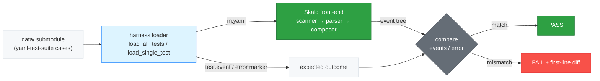

# skald-yaml-test-suite

> YAML test suite integration for skald (dev-only, not published).

**Dev-only.** This crate is never published (`publish = false`) and has **zero
external dependencies** — it depends only on `skald-core`. No `serde`, no
`serde_yaml`; the harness is plain file I/O against the official test suite's
`data/` directory format.

It validates Skald against **every case in the official
[YAML test suite](https://github.com/yaml/yaml-test-suite)** — the same suite
used to certify YAML implementations. Skald passes **735 / 735 (100%)** against
the pinned snapshot (`v2022-01-17`).

## Setup

The test cases live in a **git submodule** at `skald-yaml-test-suite/data`. After
cloning the repository, initialize it before running the suite:

```bash
git submodule update --init
```

| Submodule          | Value                                        |
| ------------------ | -------------------------------------------- |
| Path               | `skald-yaml-test-suite/data`                 |
| Upstream           | `https://github.com/yaml/yaml-test-suite.git` |
| Branch             | `data`                                        |
| Pinned tag         | `v2022-01-17` (reproducible)                  |

If the `data/` directory is absent, the integration test prints a hint
(`Run: git submodule update --init`) and returns without failing.

## Running

```bash
cargo test -p skald-yaml-test-suite
```

The integration test (`tests/yaml_test_suite.rs`) loads every case, runs it
through Skald, prints a results table (total / passed / failed / skipped / rate)
plus a failure breakdown, and asserts a minimum pass rate.

## How It Works

The harness in `src/lib.rs` works directly against the suite's `data/` layout —
no third-party YAML libraries are involved.

1. **Discover** (`load_all_tests`) — scans `data/` for 4-char alphanumeric test
   IDs (e.g. `229Q`), skipping non-test dirs such as `name/` and `tags/`. A
   directory containing `in.yaml` is a single test; otherwise its numbered
   sub-directories (`00/`, `01/`, …) are loaded as sub-tests with IDs like
   `2G84/00`. Entries are sorted for deterministic order.
2. **Load each case** (`load_single_test`) — reads:
   - `in.yaml` — the input YAML (required; absent → case is skipped).
   - `===` — human-readable test name (optional).
   - `test.event` — expected event stream, one event per non-empty line (optional).
   - `error` — a **marker file**; its presence means the parser is expected to
     **fail** on this input.
3. **Drive Skald** (`events_to_tree`) — feeds `in.yaml` through `skald-core`'s
   `Parser`, collecting each emitted `Event`. Any parse error short-circuits to
   `Err(message)`.
4. **Serialize events** (`event_to_tree_line`) — converts Skald's `EventKind`
   values into the test suite's canonical event-tree text:
   `+STR` / `-STR`, `+DOC`/`+DOC ---`, `-DOC`/`-DOC ...`, `+MAP`/`+MAP {}`,
   `+SEQ`/`+SEQ []`, `=VAL` (with style prefix `:` `'` `"` `|` `>` and escaped
   value), `=ALI *name`, plus `&anchor` and `<tag>` annotations. Special
   characters in scalars are escaped (`\n`, `\r`, `\t`, `\\`, `\b`, `\0`).
5. **Assert** (`run_test`):
   - If the `error` marker is present → **pass** when Skald returns an error,
     **fail** if it succeeds.
   - Otherwise → **pass** when the produced event lines exactly equal
     `test.event`; on mismatch, `show_diff` reports the first differing line.

This pins behavior at the **event level** (scanner → parser), the exact contract
the official suite specifies.

## Architecture



## Test Suite Provenance

The cases come from the **official [`yaml/yaml-test-suite`](https://github.com/yaml/yaml-test-suite)**,
the canonical conformance suite for YAML implementations. It is vendored as a git
submodule pinned to tag **`v2022-01-17`** so the 735-case result is fully
reproducible and immune to upstream drift. Bumping the suite is a deliberate,
reviewable change to the submodule pointer.
