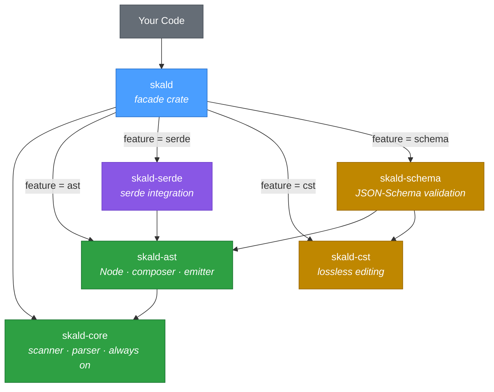
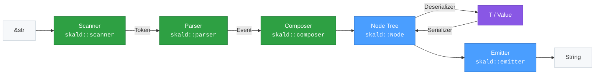

# skald

**Safe YAML for Rust** — zero `unsafe` by default, full YAML 1.2.2 spec compliance, high performance.

This is the user-facing **facade** crate: the one crate you add to your
`Cargo.toml`. It re-exports the focused Skald workspace crates
(`skald-core`, `skald-ast`, `skald-serde`, `skald-cst`, `skald-schema`)
behind Cargo feature flags, so you pull in only the representations you use.

```toml
[dependencies]
skald = "0.1"
serde = { version = "1", features = ["derive"] }
```

With the default features you get the typed **serde API**, the **node API**,
and lossless **CST** editing. Drop features to shrink the dependency tree, or
add `schema` for JSON-Schema validation.

## Feature Flags

Every feature and what it activates. Some features imply others — enabling
`serde` automatically enables `ast`; enabling `schema` automatically enables
both `ast` and `cst`.

| Feature   | Default | Pulls in                  | Implies      | Unlocks                                                              |
| --------- | :-----: | ------------------------- | ------------ | ------------------------------------------------------------------- |
| (core)    | always  | `skald-core`              | —            | `scanner`, `parser`, `error`, `limits`, `types` re-exports          |
| `ast`     |   yes   | `skald-ast`               | —            | Node API (`from_str_node`, …), `composer`, `emitter`, `Node`        |
| `serde`   |   yes   | `skald-serde` + `ast`     | `ast`        | Serde API (`from_str`, `to_string`, …), `Value`, `SerdeError`       |
| `cst`     |   yes   | `skald-cst`               | —            | Lossless, comment-preserving editing via `cst::Document`            |
| `schema`  |   no    | `skald-schema` + `ast` + `cst` | `ast`, `cst` | Span-anchored JSON-Schema validation over the `Node` tree (`schema`) |

`skald-core` is always present (not feature-gated); it carries the shared
scanner/parser front-end with `#![forbid(unsafe_code)]` and zero serde.

## Architecture

The facade is a thin re-export layer. Each edge below is gated by the feature
that enables it; `skald-core` is unconditional.



## API Surface

The facade exposes two parallel function families. The naming convention is
the disambiguator:

- **Serde API** — clean, unsuffixed names (`from_str`, `to_string`, …) that
  deserialize into / serialize from your own `T: Deserialize/Serialize`
  types. Gated by `feature = "serde"`.
- **Node API** — the same verbs with a `_node` suffix (`from_str_node`,
  `to_string_node`, …) that work directly on the `Node` tree, no serde types
  required. Gated by `feature = "ast"`.

Each row pairs the serde function with its node-API counterpart where one
exists. Function names are verified against `src/lib.rs`.

| Direction        | Serde API (`feature = "serde"`)                                   | Node API (`feature = "ast"`)              |
| ---------------- | ----------------------------------------------------------------- | ----------------------------------------- |
| Parse one (str)  | `from_str` · `from_str_with`                                      | `from_str_node`                           |
| Parse many (str) | `from_str_multi` · `from_str_multi_with`                         | `from_str_multi_node`                     |
| Parse one (read) | `from_reader` · `from_reader_with`                               | `from_reader_node`                        |
| Parse many (read)| `from_reader_multi` · `from_reader_multi_with`                  | `from_reader_multi_node`                  |
| Emit (str)       | `to_string` · `to_string_with`                                   | `to_string_node` · `to_string_node_with` |
| Emit (write)     | `to_writer` · `to_writer_with`                                   | `to_writer_node`                          |

Re-exported types and modules:

- **Serde** (`feature = "serde"`): `Value`, `BorrowedValue`, `SerdeError`,
  and the style helpers `FlowMap`, `FlowSeq`, `FoldStr`, `LitStr`; the whole
  crate as `serde_integration`.
- **AST** (`feature = "ast"`): `Node`, `Scalar`, `Sequence`, `Mapping`, the
  `composer` and `emitter` modules (`emitter::EmitterConfig`), and the crate
  as `ast`.
- **CST** (`feature = "cst"`): `cst::Document` for comment-preserving edits.
- **Schema** (`feature = "schema"`): the `schema` module.
- **Core** (always): `scanner`, `parser`, `error` (`ParserConfig`,
  `Strictness`), `limits`, `types`.

## Usage

### Deserialize with Serde

```rust
use serde::Deserialize;

#[derive(Deserialize)]
struct Config {
    name: String,
    debug: bool,
    port: u16,
}

let config: Config = skald::from_str("name: my-app\ndebug: true\nport: 8080").unwrap();
assert_eq!(config.name, "my-app");
assert_eq!(config.port, 8080);
```

### Serialize with Serde

```rust
use serde::Serialize;

#[derive(Serialize)]
struct Point { x: i32, y: i32 }

let yaml = skald::to_string(&Point { x: 1, y: 2 }).unwrap();
assert!(yaml.contains("x: 1"));
assert!(yaml.contains("y: 2"));
```

### Node API — parse and emit (no serde)

```rust
// Parse a single document into a Node tree.
let node = skald::from_str_node("hello: world").unwrap();
let entries = node.as_mapping().unwrap();
assert_eq!(entries[0].0.as_str(), Some("hello"));
assert_eq!(entries[0].1.as_str(), Some("world"));

// Emit it back to YAML (infallible).
let yaml = skald::to_string_node(&node);
assert_eq!(yaml, "hello: world\n");
```

### Multi-Document

```rust
// Typed serde: one Vec<T> for the whole stream.
let docs: Vec<String> = skald::from_str_multi("---\nhello\n---\nworld\n").unwrap();
assert_eq!(docs, vec!["hello", "world"]);

// Node API: one Node per document.
let nodes = skald::from_str_multi_node("---\na\n---\nb\n").unwrap();
assert_eq!(nodes.len(), 2);
```

### Custom configuration

```rust
use serde::Serialize;
use skald::emitter::EmitterConfig;
use skald::error::{ParserConfig, Strictness};

// Lenient parsing (last-wins duplicate keys instead of an error).
let cfg = ParserConfig { strictness: Strictness::Lenient, ..Default::default() };
let map: std::collections::HashMap<String, i32> =
    skald::from_str_with("a: 1\na: 2", cfg).unwrap();
assert_eq!(map.get("a"), Some(&2));

// Explicit `---` document markers on emit.
#[derive(Serialize)]
struct Data { key: String }
let ecfg = EmitterConfig { explicit_document: true, ..EmitterConfig::default() };
let yaml = skald::to_string_with(&Data { key: "val".into() }, &ecfg).unwrap();
assert!(yaml.starts_with("---"));
```

## Pipeline

Loading runs Scanner → Parser → Composer → Node; serde bridges the `Node`
tree to and from your `T`; dumping runs Node → Emitter. Every stage is
reachable through the facade re-exports — `skald::scanner`, `skald::parser`,
`skald::composer`, `skald::emitter` — so you can work at whatever level of
control you need.



## License

Licensed under either of [Apache-2.0](../LICENSE-APACHE-2.0) or
[MIT](../LICENSE-MIT) at your option.
